# azlogicapp

# Azure Logic App: Trigger Email Notification When a File is Created in OneDrive

## Overview

This guide explains how to create an **Azure Logic App** that automatically sends an email notification when a new file is created in a specific **OneDrive** folder. This is useful for monitoring file uploads and triggering notifications without writing any code.

---

## Prerequisites

Before you begin, ensure you have:

- An **Azure account** with permissions to create resources.
- A **OneDrive account** (personal or work).
- An **Outlook/Office 365** email account (used for sending email notifications).
- A browser and internet connection to access the Azure Portal.

---

## Steps to Create the Logic App

### Step 1: Sign in to Azure Portal

1. Open your browser and go to [https://portal.azure.com](https://portal.azure.com).
2. Log in using your Azure credentials.

---

### Step 2: Create a New Logic App (Consumption Plan)

1. In the left-hand sidebar, click on **"Create a resource"**.
2. In the search bar, type **"Logic App (Consumption)"** and select it.

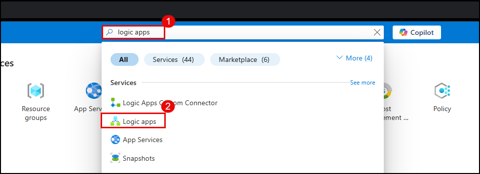
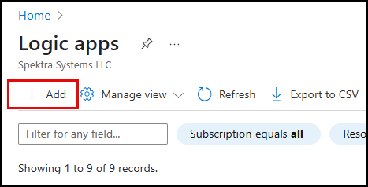


3. Click on the **"Create"** button.

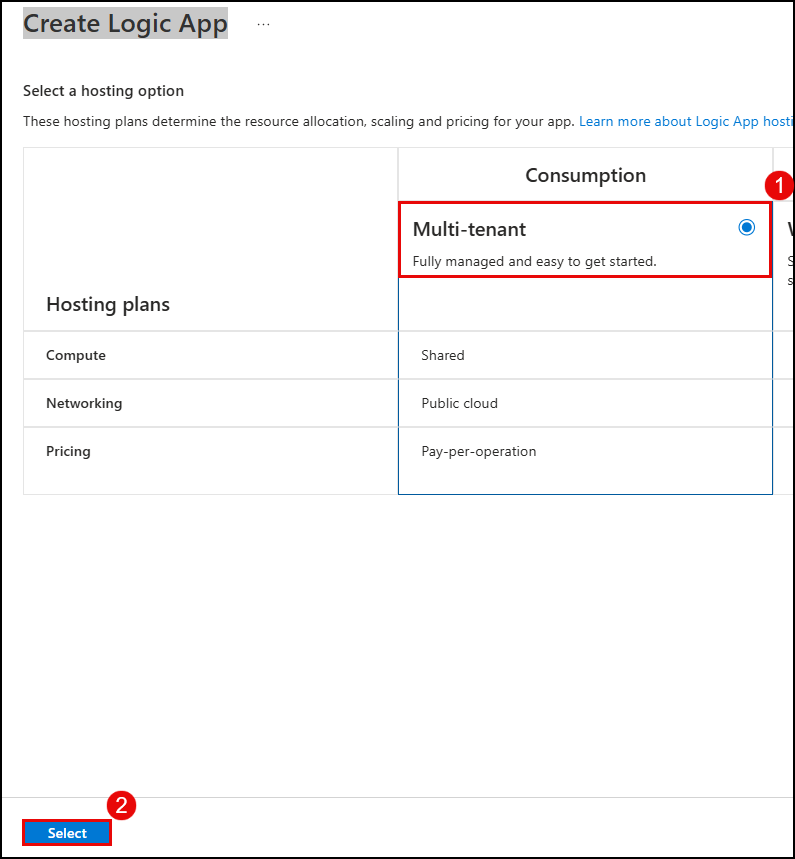

4. Fill in the required fields:
   - **Subscription**: Choose your Azure subscription.
   - **Resource Group**: Select an existing group or create a new one.
   - **Logic App name**: Enter a name such as `FileUploadWatcher`.
   - **Region**: Select the region closest to your users or data.
   - **Enable log analytics**: Optional. You can disable it for this example.
  
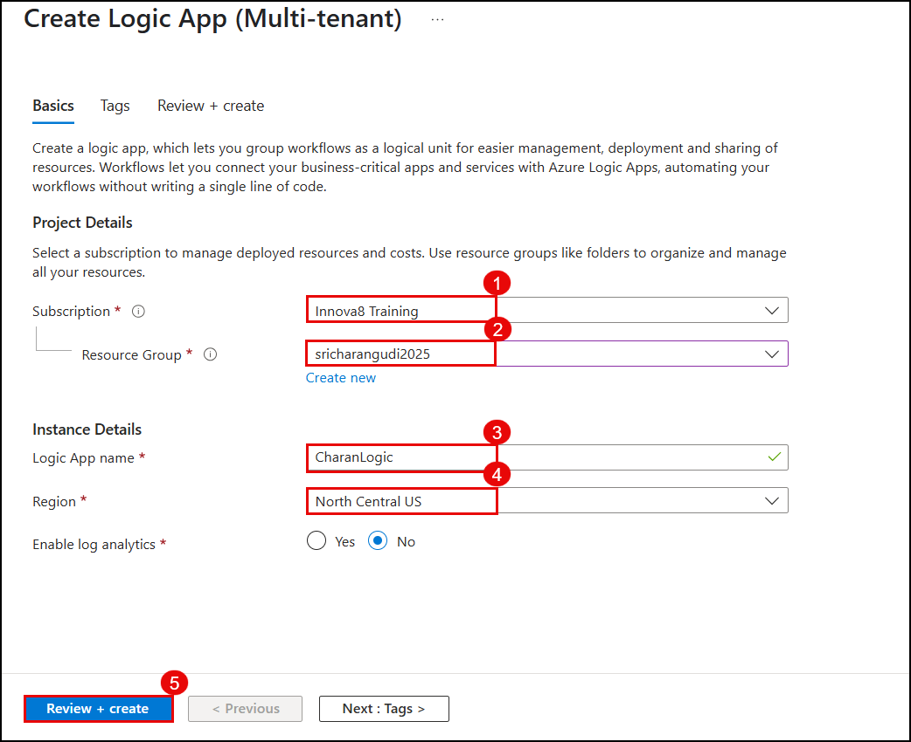


5. Click **Review + create**.
6. After validation passes, click **Create** to deploy the Logic App.

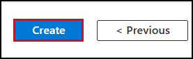


---

### Step 3: Open Logic App Designer

1. Once the deployment is complete, click **Go to resource**.

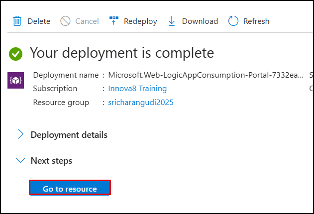

2. In the left navigation pane, click on **Logic App Designer**.
3. Choose the **"Blank Logic App"** option to start from scratch.

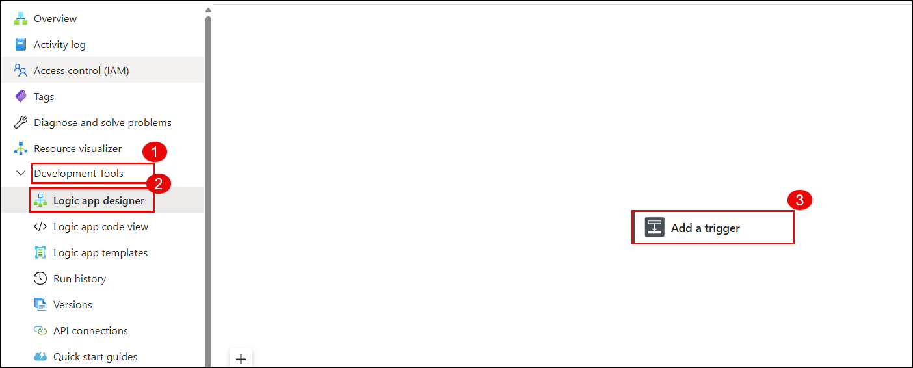

---

### Step 4: Add OneDrive Trigger

1. In the search bar at the top of the designer, type **"OneDrive"**.
2. Select **"OneDrive"** or **"OneDrive for Business"** (depending on your account type).
3. Choose the trigger **"When a file is created (properties only)"**.

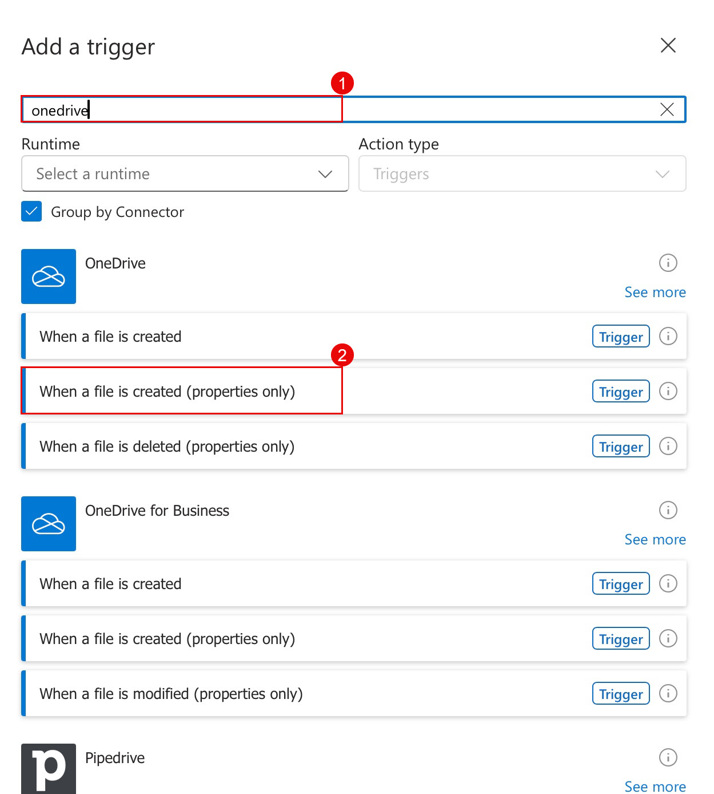

4. You will be prompted to sign in to your **OneDrive** account. Complete the authentication.
5. After signing in, configure the trigger:
   - **Folder**: Click on the folder picker and select the folder to monitor (e.g., `/Documents/Uploads`).
   - Leave other fields as default.
  
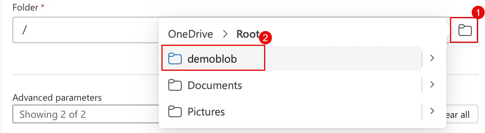


This sets up the Logic App to listen for new files added to the specified folder.

---

### Step 5: Add an Action to Send an Email

1. Click on **+ New step** below the OneDrive trigger.

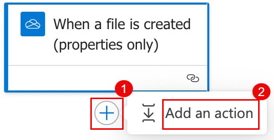

2. In the search bar, type **"Outlook"**.
3. Select the action **"Send an email (V2)"** under **Office 365 Outlook**.

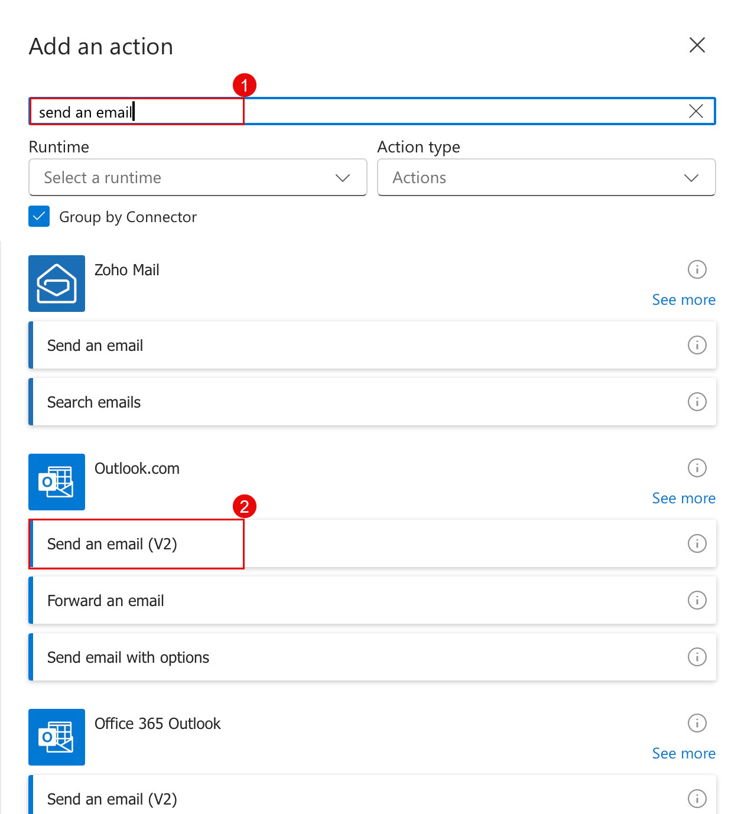

4. Sign in to your **Outlook/Office365** account when prompted.
5. Fill in the email details:
   - **To**: Enter your own email address or any recipient you want.
   - **Subject**: `New File Uploaded: @{triggerOutputs()?['body/Name']}`
   - **Body**:  
     ```
     A file named @{triggerOutputs()?['body/Name']} was uploaded to OneDrive.
     Time: @{triggerOutputs()?['body/CreatedDateTime']}
     ```

The dynamic expressions like `@{triggerOutputs()?['body/Name']}` pull values from the trigger data.

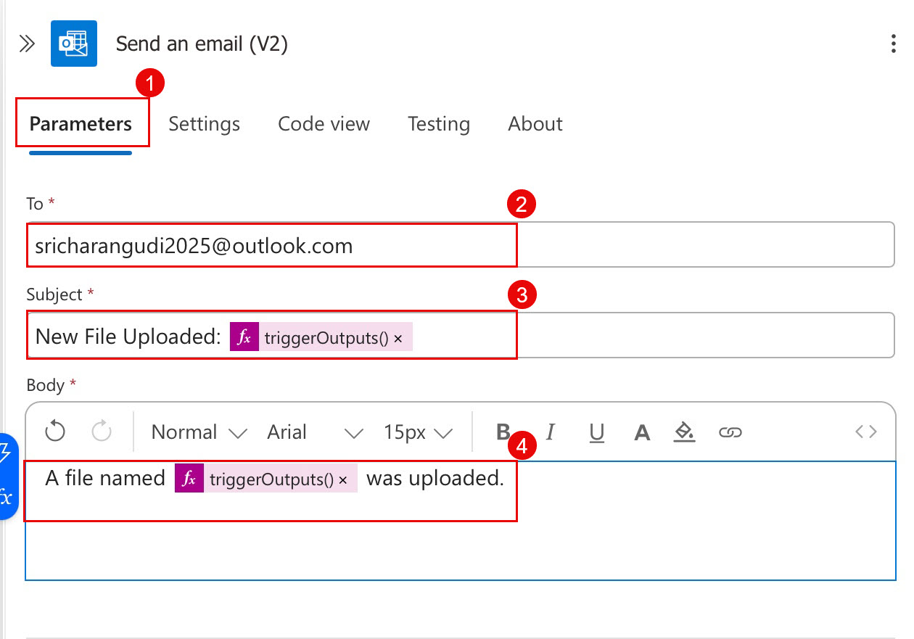

---

### Step 6: Save and Test the Logic App

1. Click the **Save** button at the top.

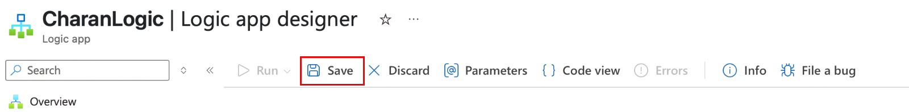

2. Upload a new file into the OneDrive folder you configured earlier.
3. Wait a few moments for the Logic App to run.

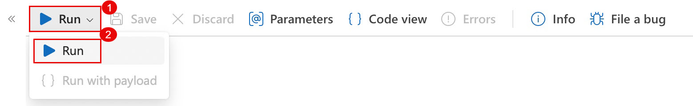
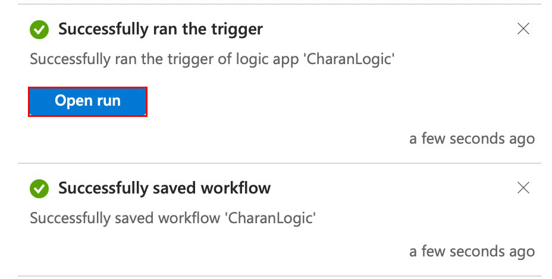

4. In the left-hand menu of the Logic App, click **Runs history** to see the execution status.

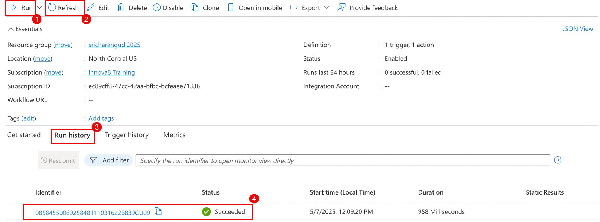

5. You should receive an email notification shortly after the file upload.

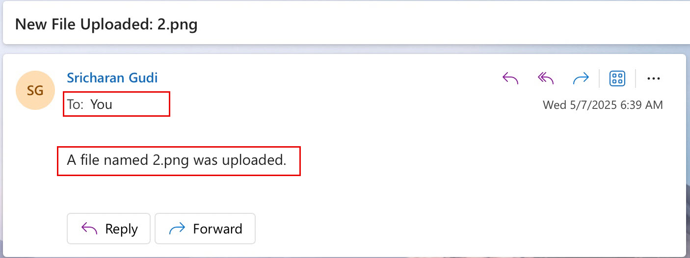


---

## Summary

You have successfully created an Azure Logic App that:

- Monitors a specified folder in OneDrive.
- Sends an automated email notification every time a new file is uploaded.

This no-code integration can be extended further by connecting to other services like Microsoft Teams, SharePoint, or Azure Blob Storage.

---

## Notes

- Make sure you have the correct permissions on OneDrive and Outlook for this automation to work.
- If you're using a corporate account, admin consent may be required to allow Logic Apps to access OneDrive or send emails.
- You can enhance the email by including file metadata or links to the file.

---

